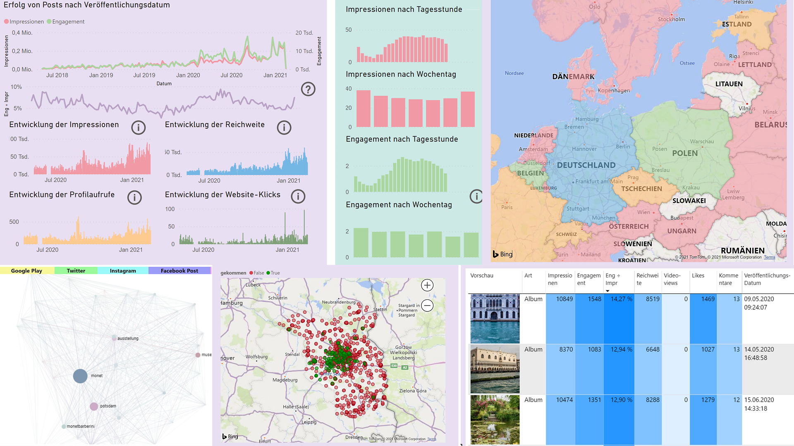

# Barberini Analytics

[](https://www.slideshare.net/secret/fSNLlGAOzk34)
[](https://youtu.be/Z8s3fdrzI7c?t=7170)
[](https://hpi.de/fileadmin/user_upload/hpi/veranstaltungen/2020/Bachelorpodium_2020/Pressemitteilung_BP_2020_Bachelorprojekte/Pressemitteilung_BP2020_Pressemitteilung_FN1_V2.pdf)

A suite of data mining, analytics, and visualization solutions to create an awesome dashboard for the Museum Barberini, Potsdam, in order to help them analyze and assess customer, advertising, and social media data!

This solution has been originally developed in part of a Data Analytics project run as a cooperation of the Museum Barberini (MB) and the Hasso Plattner Institute (HPI) in 2019/20 (see [Credits](#credits) below).
The project comprises a data mining pipeline that is regularly run on a server and feeds several visualization dashboards that are hosted in a Power BI app.
For more information, see also the following resources:

- [System architecture slides](https://www.slideshare.net/secret/fSNLlGAOzk34)
- [Original project description](https://www.museum-barberini.com/site/assets/files/1080779/fg_naumann_bp_barberini_2019-20.pdf) (German)
- [Final press release](https://hpi.de/fileadmin/user_upload/hpi/veranstaltungen/2020/Bachelorpodium_2020/Pressemitteilung_BP_2020_Bachelorprojekte/Pressemitteilung_BP2020_Pressemitteilung_FN1_V2.pdf) (German)
- [Official presentation video](https://www.tele-task.de/lecture/video/8266/#t=5961) ([mirror on YouTube](https://youtu.be/Z8s3fdrzI7c?t=7170))



## Note regarding reuse for other projects

While this solution has been tailored for the individual needs of the MB and the overall project is characterized by the structure of a majestic monolith, we think that it contains some features and components that have great potential for being reused as part of other solutions.
In particular, these features include the following highlights:

- **Gomus binding:** Connectors and scrapers for accessing various data sources from the museum management system _go~mus_.
  See [`src/gomus`](./src/gomus) and the relevant [documentation](DOCUMENTATION.md#data-sources).
- **Apple App Store Reviews binding:** Scraper for fetching all user reviews about an app in the Apple App Store.
  See [`src/apple_appstore`](./src/apple_appstore.py) and the relevant [documentation](DOCUMENTATION.md#data-sources).
- **Visitor Prediction:** Machine-Learning (ML) based solution to predict the future number of museum visitors by extrapolating historic visitor data.
  See [`src/visitor_prediction`](./src/visitor_prediction).
  
  Credits go to Georg Tennigkeit (@georg.tennigkeit/@georgt99).
- **Postal Code Cleansing:** Collection of heuristics to correct address information entered by humans with errors.
  See [`src/_utils/cleanse_data.py`].
  
  Credits go to Laura Holz (@laura.holz/@lauraholz).
- **Power BI Crash Tests:** Load & crash tests for Power BI visualization reports.
  See <https://github.com/LinqLover/pbi-crash-tests>.
  
  Credits go to Christoph Thiede (@christoph.thiede/@LinqLover).

Development is currently being continued in a private GitLab instance but a [mirror of the repository is available on GitHub](https://github.com/Museum-Barberini-gGmbH/Barberini-Analytics).

If you are interested in reusing any part of our solution and have further questions, ideas, or bug reports, please do not hesitate to contact us!

## Backend

### Installation

#### Requirements

- UNIX system

Please note that these instructions are optimized for Ubuntu/amd64.
If you use a different configuration, you may need to adjust the toolchain installation (see `install_toolchain.sh`).

#### Actual installation

1. Clone the repository using git

   ```bash
   git clone https://github.com/Museum-Barberini-gGmbH/Barberini-Analytics.git
   ```

   * For best convenience, clone it into `/root/bp-barberini`.

2. Copy the `secrets` folders (which is not part of the repository) into `/etc/barberini-analytics`.

3. Set up the toolchain.
   See `scripts/setup/install_toolchain.sh` how to do this.
   If you use ubuntu/amd64, you can run the script directly.
   Use `sudo` to run the commands!

4. Set up the docker network and add the current user to the `docker` user group.

   ```bash
   ./scripts/setup/setup_docker.sh
   ```

#### Schedule regular DB updates

Run `sudo scripts/setup/setup_cron.sh`.
If you cloned the repository in a different folder than `/root/bp-barberini`, you may want to adapt the paths in `scripts/setup/.crontab` first.
If no crontab exists before, create it using `crontab -e`.

#### Configuration

See [`CONFIGURATION.md`](CONFIGURATION.md).

### Usage

#### Controlling the pipeline

##### Open the luigi webinterface

```bash
 make docker-do do='make luigi-scheduler'
```

This will also start a webserver on <http://localhost:8082> where you can trace all running tasks.

##### Running the pipeline manually

```bash
 make docker-do do='make luigi'
```

##### Accessing the docker containers

Have a look at our beautiful `Makefile`!
To access the luigi docker, do:

```bash
make startup connect
```

Close the session by executing:

```bash
make shutdown
```

## Frontend (Power BI)

### Installation

#### Requirements

- Windows 10

#### Actual Installation

1. Download and install Power BI: <https://aka.ms/pbidesktopstore>
2. Enable R-powered visuals
   1. Download and install R: <https://mran.revolutionanalytics.com/download>
   2. Once you open any report, you will be asked to install R Visual for PBI.
      Confirm that.

## Complete documentation

See [`DOCUMENTATION.md`](DOCUMENTATION.md).

## Maintenance

See [`MAINTENANCE.md`](MAINTENANCE.md).

## Credits

**Authors:** Laura Holz, Selina Reinhard, Leon Schmidt, Georg Tennigkeit, Christoph Thiede, Tom Wollnik (bachelor project BP-FN1 @ HPI, 2019/20).  
**Organizations:** [Hasso Plattner Institute, Potsdam](https://hpi.de/en); [Museum Barberini](https://www.museum-barberini.com/en/); Hasso Plattner Foundation.
